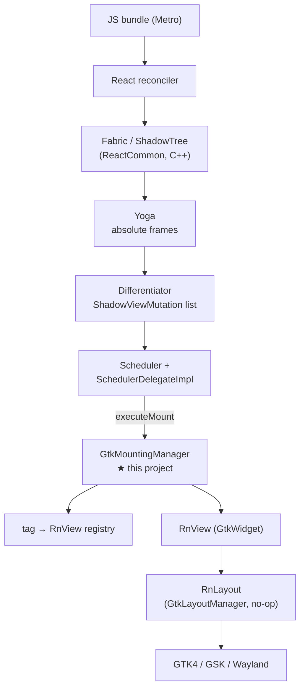

# Architecture

How React Native runs on Linux in this project, and why the pieces are
arranged the way they are.

## Where this sits

React Native's C++ core is platform-agnostic. Meta maintains three platform
layers on top of it, as siblings under `packages/react-native/`:

| Layer | Maintainer | Host |
|---|---|---|
| `ReactAndroid` | Meta | Android |
| `ReactApple` | Meta | iOS/macOS |
| `ReactCxxPlatform` | Meta | generic C++ |

`ReactCxxPlatform` is the one that matters here. It is neither Android nor
Apple, it is actively maintained, and it already provides `ReactHost`,
`SchedulerDelegateImpl`, http, io, logging, threading, profiling, devsupport,
coremodules and TurboModule hosting. This project is a *consumer* of it, not a
fork of it.

Proof it works off-Apple/Android: `private/react-native-fantom/tester/` is a
CMake-built C++ host that runs on Linux today — its `CMakeLists.txt` has an
explicit `if(UNIX AND NOT APPLE)` branch and `getHostPlatform.js` maps
`process.platform === 'linux'` to a supported host. Hermes, Yoga and Fabric
all build here already.

## The seam

`ReactHost`'s constructor takes a `std::shared_ptr<IMountingManager>`. That
interface has exactly **two** pure-virtual methods:

```cpp
virtual void executeMount(SurfaceId, MountingTransaction&&) = 0;
virtual void dispatchCommand(const ShadowView&, const std::string&, const folly::dynamic&) = 0;
```

Everything else is defaulted, including a pre-declared accessibility contract
(`setAccessibilityFocusedView`, `accessibleClickAction`,
`accessibleScrollInDirection`, ...) waiting to be filled in against AT-SPI.

Implementing that interface against GTK4 is the whole project.



## The view layer

`RnView` is a `GtkWidget` subclass; `RnLayout` is a `GtkLayoutManager` that
performs **no layout**. Yoga has already resolved absolute frames by the time a
mutation arrives, so:

- `RnLayout::measure` returns 0, so GTK never second-guesses Yoga.
- `RnLayout::allocate` places each child at the rect the shadow tree assigned.

This is the same conclusion `react-native-gtkx` reached independently with its
`RnGtkxLayout`, which is some evidence it is the right shape.

`RnView` deliberately has no React Native dependency. It knows only about
frames and paint properties. That keeps it independently buildable and
testable (`demo_layout`), and keeps RN types out of the widget layer.

## Mutation semantics

Read off `StubViewTree::mutate`, RN's own reference walk:

| Mutation | `parentTag` | Meaning |
|---|---|---|
| `Create` | `-1` | Allocate a widget, register by tag. Not attached. |
| `Delete` | `-1` | Unregister, drop the last reference. |
| `Insert` | parent | Attach an existing child at `index`. |
| `Remove` | parent | Detach, but do **not** destroy. |
| `Update` | parent | New props / layout metrics for an existing tag. |

Two consequences the implementation depends on:

- Create/Delete are **registry** operations; Insert/Remove are **tree**
  operations. A view can sit in the registry with no parent between a Remove
  and its Delete, so the registry holds a strong reference
  (`g_object_ref_sink` on Create, `g_object_unref` on Delete).
- `mutatedViewIsVirtual()` marks views that exist only in the shadow tree to
  keep an `EventEmitter` alive. They have no widget; skip them on Insert and
  Remove. (It is hardcoded `false` off-Android, but honouring it keeps parity.)

Fabric emits **no `Create` for a surface root** — the root shadow node is the
base of every diff. The host calls `createSurfaceRoot(surfaceId)` before
`startSurface`. In Fabric a `SurfaceId` *is* the root node's tag, which lets
the root live in the same registry as every other view.

## Threading

`executeMount` is reached from
`SchedulerDelegateImpl::schedulerShouldRenderTransactions`, which is driven by
the host's `RunLoopObserverManager`. Because the **host** owns that observer,
wiring it to GTK's frame clock puts mounting on the GTK main thread by
construction — no marshalling, no locks around the widget tree.

`GtkMountingManager` records its construction thread and asserts the invariant
rather than assuming it.

## Component registry

`getDefaultComponentRegistryFactory()` is declared in ReactCommon and
implemented **nowhere in the tree**. Each host writes its own, and in doing so
declares which components its platform supports. Fantom has its own version
registering the full set.

Ours (`src/LinuxComponentRegistry.h`) registers only `ViewComponentDescriptor`.
Adding a component to that list is a promise that a GTK peer exists for it, so
the list grows only as peers are written:

| Component | Blocked on |
|---|---|
| `Paragraph` / `Text` / `RawText` | a Pango `TextLayoutManager` |
| `Image` | an `IImageLoader` implementation |
| `ScrollView` | a `GtkScrolledWindow` peer |

## Text layout

The single largest remaining piece. `textlayoutmanager/platform/cxx` is a stub:
it ignores `ParagraphAttributes` entirely and returns
`layoutConstraints.minimumSize`, measuring nothing.

A Linux implementation means mapping RN's `AttributedString` /
`ParagraphAttributes` onto Pango — line breaking, bidi, shaping, font
fallback, ellipsis modes, and per-fragment attributes — and doing it faithfully
enough that layout matches the other platforms.

## Build architecture

A host build has no gradle step to download third-party dependencies, so the
project supplies them:

- `cmake/ReactNativeCore.cmake` adds the 29 RN targets in the transitive
  closure of `react_renderer_mounting`, computed from RN's own
  `target_link_libraries`. Notably **Hermes is not in that closure** —
  mounting does not require a JS runtime.
- `cmake/ThirdParty.cmake` supplies the third-party target *names* RN links
  against, backed by system packages where possible (glog, boost, fmt,
  double-conversion) and vendored sources where not (folly, fast_float, both
  pinned to the versions in RN's `libs.versions.toml`).

The six non-obvious requirements, and the upstream bug found while building,
are documented in the project README.

## Roadmap

| Phase | Deliverable | State |
|---|---|---|
| 0 | GTK view layer, mounting manager, RN core builds | **done** |
| 1 | Real mutations → GTK widgets, no JS | **done** |
| 2 | `ReactHost` + Hermes + a live surface | next |
| 3 | Metro bundle, `<View>` + flexbox, Fast Refresh | |
| 4 | Pango `TextLayoutManager`, `<Text>` | |
| 5 | `IImageLoader`, input & gestures | |
| 6 | AT-SPI accessibility | |
| 7 | `react-native-linux` npm package, `run-linux` CLI, packaging | |

## Risks

**`ReactCxxPlatform` has no API stability guarantee.** Fantom builds it with
`RN_BUILDING` to reach private includes. It will churn. Mitigation: Meta keeps
it working for their own CI, so breakage tends to be mechanical.

**The RN version treadmill.** `react-native-windows` sits ~3 releases behind
core and `react-native-macos` ~6, with paid teams. A solo platform will lag
harder. Mitigation: track the C++ surface Fantom exercises, since Meta has a
CI incentive to keep exactly that compiling.

**Third-party native modules are not portable for free.** Reanimated,
gesture-handler, svg and friends ship ObjC/Java/Kotlin. This architecture gives
a path to porting them (they are TurboModules and Fabric components with C++
codegen) but each still needs a Linux backend written.
