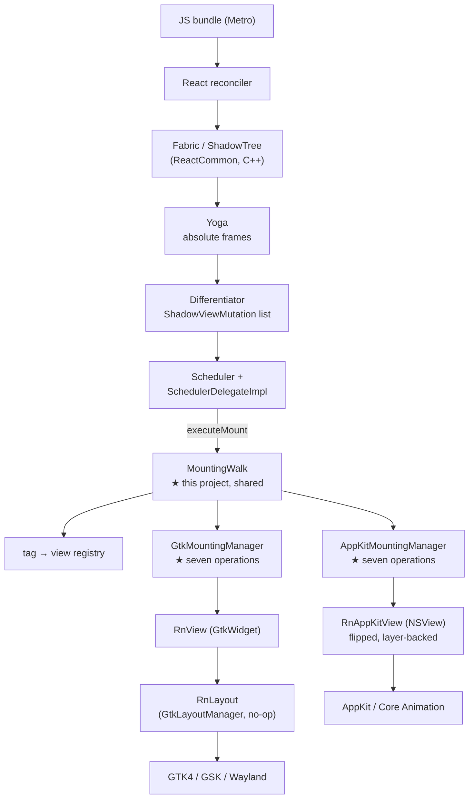

# Architecture

How React Native runs on Linux in this project, and why the pieces are
arranged the way they are.

## Where this sits

React Native's C++ core is platform-agnostic. Meta maintains three platform
layers on top of it, as siblings under `packages/react-native/`:

| Layer | Maintainer | Host |
|---|---|---|
| `ReactAndroid` | Meta | Android |
| `ReactApple` | Meta | iOS/macOS |
| `ReactCxxPlatform` | Meta | generic C++ |

`ReactCxxPlatform` is the one that matters here. It is neither Android nor
Apple, it is actively maintained, and it already provides `ReactHost`,
`SchedulerDelegateImpl`, http, io, logging, threading, profiling, devsupport,
coremodules and TurboModule hosting. This project is a *consumer* of it, not a
fork of it.

Proof it works off-Apple/Android: `private/react-native-fantom/tester/` is a
CMake-built C++ host that runs on Linux today — its `CMakeLists.txt` has an
explicit `if(UNIX AND NOT APPLE)` branch and `getHostPlatform.js` maps
`process.platform === 'linux'` to a supported host. Hermes, Yoga and Fabric
all build here already.

## The seam

`ReactHost`'s constructor takes a `std::shared_ptr<IMountingManager>`. That
interface has exactly **two** pure-virtual methods:

```cpp
virtual void executeMount(SurfaceId, MountingTransaction&&) = 0;
virtual void dispatchCommand(const ShadowView&, const std::string&, const folly::dynamic&) = 0;
```

Everything else is defaulted, including a pre-declared accessibility contract
(`setAccessibilityFocusedView`, `accessibleClickAction`,
`accessibleScrollInDirection`, ...) waiting to be filled in against AT-SPI.

Implementing that interface against GTK4 is the whole project.



## The view layer

`RnView` is a `GtkWidget` subclass; `RnLayout` is a `GtkLayoutManager` that
performs **no layout**. Yoga has already resolved absolute frames by the time a
mutation arrives, so:

- `RnLayout::measure` returns 0, so GTK never second-guesses Yoga.
- `RnLayout::allocate` places each child at the rect the shadow tree assigned.

This is the same conclusion `react-native-gtkx` reached independently with its
`RnGtkxLayout`, which is some evidence it is the right shape.

`RnView` deliberately has no React Native dependency. It knows only about
frames and paint properties. That keeps it independently buildable and
testable (`demo_layout_gtk`), and keeps RN types out of the widget layer.

## Mutation semantics

Read off `StubViewTree::mutate`, RN's own reference walk, and implemented once
in `native/core/MountingWalk.h` for every desktop platform. None of what follows
is about a toolkit, and writing it twice would mean two chances to get it subtly
different -- which shows up as a layout that is wrong on one desktop and right on
another. Each platform supplies seven operations that do touch a view:
`createView`, `createRootView`, `destroyView`, `insertChild`, `removeChild`,
`updateView` and `forgetTag`.

| Mutation | `parentTag` | Meaning |
|---|---|---|
| `Create` | `-1` | Allocate a widget, register by tag. Not attached. |
| `Delete` | `-1` | Unregister, drop the last reference. |
| `Insert` | parent | Attach an existing child at `index`. |
| `Remove` | parent | Detach, but do **not** destroy. |
| `Update` | parent | New props / layout metrics for an existing tag. |

Two consequences the implementation depends on:

- Create/Delete are **registry** operations; Insert/Remove are **tree**
  operations. A view can sit in the registry with no parent between a Remove
  and its Delete, so the registry holds a strong reference: `g_object_ref_sink`
  on Create and `g_object_unref` on Delete under GObject, and on macOS the map
  entry itself under ARC, which is why `destroyView` there is a no-op. The hook
  exists regardless, because the walk still has to say *when* a view stops being
  owned even on a platform where saying it costs nothing.
- `mutatedViewIsVirtual()` marks views that exist only in the shadow tree to
  keep an `EventEmitter` alive. They have no widget; skip them on Insert and
  Remove. (It is hardcoded `false` off-Android, but honouring it keeps parity.)

Fabric emits **no `Create` for a surface root** — the root shadow node is the
base of every diff. The host calls `createSurfaceRoot(surfaceId)` before
`startSurface`. In Fabric a `SurfaceId` *is* the root node's tag, which lets
the root live in the same registry as every other view.

## Threading

`executeMount` runs on the **JS thread**, not the UI thread. The path is:

```
Scheduler::uiManagerDidFinishTransaction
  -> RuntimeScheduler::scheduleRenderingUpdate      (queues)
  -> RuntimeScheduler_Modern::updateRendering       (JS thread, jsi::Runtime live)
  -> SchedulerDelegateImpl::schedulerShouldRenderTransactions
  -> IMountingManager::executeMount
```

`updateRendering` is the "update the rendering" step of React Native's event
loop, drained inside `executeTask` with the runtime live. So a mounting manager
must not touch platform widgets there. iOS and Android both marshal at this
point -- that is what `RCTMountingManager`'s main-thread dispatch and Android's
`MountItemDispatcher` are for.

`GtkMountingManager::executeMount` therefore only moves the transaction onto a
`g_idle_add_full(G_PRIORITY_DEFAULT, ...)` source; `applyTransaction` does the
widget work on the GTK main thread and asserts it got there. Queuing is
unconditional even when already on the main thread, because GLib idle sources
at equal priority run in insertion order, and that ordering is what keeps the
mutation stream correct.

Imperative commands take the same trip, for the same reason.
`schedulerDidDispatchCommand` arrives on the JS thread inside that same
rendering update, so `dispatchCommand` queues onto an idle source and
`applyCommand` does the widget work. Queuing at the same priority as a mount is
not incidental: it keeps a command behind the transaction that created the view
it names, which is what `focus()` on a freshly mounted field depends on.

`RunLoopObserverManager`, despite the name, is **not** what drives mounting. It
creates the `EventBeat` that flushes the event queue in step with the run loop.

Nothing an `EventEmitter` produces reaches JavaScript without it.
`EventQueue::onEnqueue` only sets a flag on the beat; the queue is flushed when
something calls `RunLoopObserverManager::onRender()`. React Native asks for
`Activity::BeforeWaiting` -- run once the loop has drained its work and is about
to sleep, which on iOS is a `CFRunLoopObserver` and on Android the Choreographer.

`native/src/GtkRunLoopObserver.cpp` is the GLib equivalent: a `GSource` that does the
work in `prepare()` and never reports itself ready. `prepare()` runs once per
main-loop iteration before the poll, so it costs a call when the loop is busy
and nothing at all when the application is idle -- unlike a frame-clock tick
callback, which would hold the clock open and wake the process at display rate
forever.

`AnimationChoreographer` is separate and *is* on the frame clock; see
`native/src/GtkAnimationChoreographer.cpp`.

## Input

`native/src/GtkTouchDispatcher.cpp` turns GTK input into touch events. React Native's
Pressability -- what backs every `onPress` -- runs on the responder system in
JavaScript, and the responder system is fed by touchstart/touchmove/touchend, so
a desktop pointer is reported as a single touch point. W3C pointer events exist
alongside these but are only consulted for hover, behind a feature flag.

Controllers are attached to the surface root, not to every view. A controller
per widget would have to be created and destroyed on every mutation and would
still need the same hit test, and `gtk_widget_pick` already walks the widget tree
and returns the deepest widget at a point -- the answer React Native's own hit
testing is looking for, now that every view is allocated at the frame Yoga gave
it.

## View flattening, and why the widget tree is flatter than the JSX

The mutation stream does not mirror the component tree. React Native flattens
views that do not need to group anything natively, and hoists their children
into the nearest ancestor that does, with layout metrics rebased onto it. A
`<View>` holding a row of an `<Image>` and a `<Text>` arrives as three
*siblings* of the scroll content, not as a parent and two children.

This is visible in a `BASALT_DUMP_TREE` dump and is easy to mistake for a
mounting bug, because it is invisible on screen: each view is placed at the
frame Fabric gave it either way. A `<Pressable>` is not flattened -- it handles
touches, so it forms a stacking context -- which is why its label *does* appear
nested.

Two consequences worth knowing. Hit testing returns the innermost view under a
point, which may be a hoisted child rather than the component that handles the
press; the responder system bubbles through the shadow tree, so `onPress` still
fires, and `scripts/integration_test.py` has a scenario that pins that down.
And `overflow: hidden` still works, because a view that clips is not flattened.

## Component registry

`getDefaultComponentRegistryFactory()` is declared in ReactCommon and
implemented **nowhere in the tree**. Each host writes its own, and in doing so
declares which components its platform supports. Fantom has its own version
registering the full set.

Ours is `native/src/LinuxComponentRegistry.h`. Adding a component to that list is a
promise that a GTK peer exists for it, so the list grows only as peers are
written:

| Component | State |
|---|---|
| `View` | done |
| `Paragraph` / `Text` / `RawText` | done, on Pango |
| `Image` | done, on GdkTexture; the platform loads its own pixels |
| `ScrollView` | done, as a clipping view with a scroll offset |

Only `Paragraph` of the three text descriptors mounts: `<Text>` becomes a Text
node and its string a RawText node, both of which live only in the shadow tree,
folded into the outermost `<Text>`'s `AttributedString`.

## Text input

`<TextInput>` is React Native's *iOS* C++ component, compiled unchanged. Its
props, shadow node, state and event emitter include nothing but ReactCommon
headers and measure through whatever `TextLayoutManager` is installed, which
here is the Pango one. Android's variant includes `fbjni` and calls into a Java
`FabricUIManager`, so it is unusable outside an Android build.

The editing is a real `GtkText` -- the widget inside `GtkEntry` -- held as a
non-`RnView` child of the view Fabric mounted, and allocated inside that view's
content inset so padding and borders apply. It brings input methods, selection,
the clipboard and every Linux keybinding with it.

The interesting problem is that `<TextInput>` is a controlled component while
`GtkText` holds state of its own, so `native/src/GtkTextInput.cpp` exists mostly to
reconcile the two: an `applying` flag so pushing a prop is not reported back as
typing, a saved cursor position so the caret does not go home mid-word, and
React Native's `eventCount` so a command older than what the user has since
typed is dropped. See `plan/09-textinput.md`.

The JavaScript side is this project's own file rather than React Native's, which
branches on `Platform.OS` being exactly `'android'` or `'ios'` and renders
undefined on anything else. It is the only fork in the tree.

## Text layout

The single largest remaining piece. `textlayoutmanager/platform/cxx` is a stub:
it ignores `ParagraphAttributes` entirely and returns
`layoutConstraints.minimumSize`, measuring nothing.

A Linux implementation means mapping RN's `AttributedString` /
`ParagraphAttributes` onto Pango — line breaking, bidi, shaping, font
fallback, ellipsis modes, and per-fragment attributes — and doing it faithfully
enough that layout matches the other platforms.

## Build architecture

A host build has no gradle step to download third-party dependencies, so the
project supplies them:

- `native/cmake/ReactNativeCore.cmake` adds the 29 RN targets in the transitive
  closure of `react_renderer_mounting`, computed from RN's own
  `target_link_libraries`. Notably **Hermes is not in that closure** —
  mounting does not require a JS runtime.
- `cmake/ThirdParty.cmake` supplies the third-party target *names* RN links
  against, backed by system packages where possible (glog, boost, fmt,
  double-conversion) and vendored sources where not (folly, fast_float, both
  pinned to the versions in RN's `libs.versions.toml`).

The six non-obvious requirements, and the upstream bug found while building,
are documented in the project README.

## Roadmap

| Phase | Deliverable | State |
|---|---|---|
| 0 | GTK view layer, mounting manager, RN core builds | **done** |
| 1 | Real mutations → GTK widgets, no JS | **done** |
| 2 | `ReactHost` + Hermes + a live surface | **done** |
| 3 | Metro bundle, `<View>` + flexbox, Fast Refresh | **done** |
| 4 | Pango `TextLayoutManager`, `<Text>` | **done** |
| 5 | Input & gestures | **done** |
| 6 | `<Image>`, `<ScrollView>` | **done** |
| 7 | Accessibility, and a test suite | **done** |
| 8 | The `linux` Metro platform | **done** |
| 9 | `<TextInput>` | **done** |
| 10 | Point the host at a real app, and find out what breaks | **done** |
| 11 | Run against a released React Native, not just `main` | **done** |
| 12 | `run-linux` CLI and an installable package | in progress |
| 12a | Build from an installed React Native, on a pinned triple | **done** |
| 13 | Port one third-party native module end to end | |
| 14 | Expo's native runtime | **done** |
| 15 | The asset pipeline | **done** |
| 16 | Split the shared core from the toolkit | **started** |
| 17 | A second view layer: macOS or Windows | |
| 18 | Core modules: appearance, clipboard, linking, alerts | |
| 16 | Desktop capabilities: windows, menus, file dialogs | |
| 17 | Packaging: Arch, Flatpak | |

Phases 13 onwards are a proposal rather than a commitment. What is not a
proposal is that they were previously one row reading "Expo, CLI, packaging",
which hid that Expo alone is likely larger than the two phases before it. See
`plan/backlog.md` for the detail behind each.

## Which components a platform claims

`getDefaultComponentRegistryFactory()` is declared by ReactCommon and defined
nowhere in it: each host supplies its own and, in doing so, declares what its
platform can put on screen. It is defined per platform here --
`gtk/ComponentRegistryGtk.cpp` with seven descriptors, `mac/ComponentRegistryAppKit.mm`
with one -- and that is not tidiness. `ParagraphComponentDescriptor` constructs a
`TextLayoutManager`, whose stub this build drops so the platform's own can be the
only definition, so a shared registry means a platform with no text engine fails
to link rather than failing to render text.

The set a platform registers has to match what its mounting manager answers
`hasComponent` for. When they disagree the registry wins, Fabric builds shadow
nodes nothing can mount, and the app renders blank rectangles rather than
reporting anything.

## Testing

Three suites: `build/basalt_gtk_tests` for everything reachable without a JavaScript
runtime, `scripts/integration_test.py` for the whole stack, asserting on the
widget tree the host dumps rather than on a screenshot, and `build/basalt_appkit_tests`
for the macOS view layer and mounting manager. See `docs/TESTING.md`, which also
records what is still not covered and why.

## Risks

**`ReactCxxPlatform` has no API stability guarantee.** Fantom builds it with
`RN_BUILDING` to reach private includes. It will churn. Mitigation: Meta keeps
it working for their own CI, so breakage tends to be mechanical.

**The RN version treadmill.** `react-native-windows` sits ~3 releases behind
core and `react-native-macos` ~6, with paid teams. A solo platform will lag
harder. Mitigation: track the C++ surface Fantom exercises, since Meta has a
CI incentive to keep exactly that compiling.

**Third-party native modules are not portable for free.** Reanimated,
gesture-handler, svg and friends ship ObjC/Java/Kotlin. This architecture gives
a path to porting them (they are TurboModules and Fabric components with C++
codegen) but each still needs a Linux backend written.
